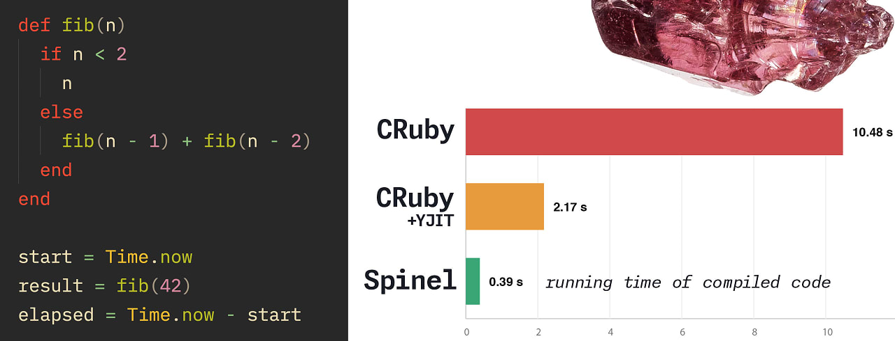

*A complete look at what [Spinel](https://github.com/matz/spinel) is, how it works, where it came from, what it can/can't do, and where it might eventually fit into the broader Ruby ecosystem.*

# What *is* Spinel?

From the [README](https://github.com/matz/spinel):

> Spinel compiles Ruby source code into standalone native executables. It performs whole-program type inference and generates optimized C code, achieving significant speedups over CRuby.
>
> Spinel is self-hosting: the compiler backend is written in Ruby and compiles itself into a native binary.

As a Rubyist who remembers the era when Ruby was slumped near the bottom of the benchmarks, this is obviously exciting. I'll get more into its history later, but a few points to keep in mind:

* it's an experiment/research
* it only supports a *subset* of Ruby (no Rails apps anytime soon/ever!)
* it's not a successor to CRuby

In technical terms, it's an ahead-of-time (AOT) compiler that turns Ruby source into a standalone native binary (by way of C) depending only on `libc` (the C library) and `libm` (maths library).

With the end result being an executable file, there's no VM, no interpreter, and no 'warm-up' like you get with JIT compilation. This means high levels of raw performance out of the gate, but at the cost of much of Ruby's usual flexibility. I'll address these limitations later.

## And how it does it.. (at a high level, anyway)

Spinel's compiler has a three-stage pipeline:

* `spinel_parse`: A parser that uses Prism to translate Ruby code into an [AST](https://en.wikipedia.org/wiki/Abstract_syntax_tree).
* `spinel_codegen`: The bulk of the compiler. It takes the AST and creates C source.
* The system's C compiler is then called to compile the C into an executable.

The C code relies upon a runtime made up of a [sp_runtime.h](https://github.com/matz/spinel/blob/master/lib/sp_runtime.h) header and a static `libspinel_rt.a` library to provide GC, strings, arrays, hashes, and so on.

# Where it came from

Matz had the idea behind Spinel [since Ruby's 30th anniversary in 2023](https://x.com/yukihiro_matz/status/2047715562328121367) but only recently got around to implementing it (in about a month) with the aid of *Claude Code* (which Matz has also been using to work on [mruby](https://mruby.org/)). 

> Matz is the exact kind of programmer who can use AI responsibly. The guy knows what he is doing. AI gets you as good as your engineering and computer science chops get you.
>
> [*rs86* on Lobsters](https://lobste.rs/s/kd4xkt/spinel_ruby_aot_native_compiler#c_i9r5o4)

Spinel isn't the first attempt to create an AOT compiler for Ruby. The Sorbet project [teased *Sorbet Compiler*](https://sorbet.org/blog/2021/07/30/open-sourcing-sorbet-compiler) several years ago which used Sorbet's type system and LLVM to similar ends, although the project was eventually shelved.

Anyway, Spinel started out being written in C, then regular Ruby, before moving to a self-hostable version written in Spinel-compatible Ruby itself (you can [see that here](https://github.com/matz/spinel/blob/master/spinel_codegen.rb) in the mammoth 20,000+ line `spinel_codegen.rb` file!)

Spinel is a natural choice of name as [the gemstone 'spinel'](https://en.wikipedia.org/wiki/Spinel) is a mineral closely related to rubies and, at one time, the terms were often confused with one another. However, Matz says it's named [after his cat](https://news.ycombinator.com/item?id=47887946) which is, itself, named after a character from a manga series called *Cardcaptor Sakura* who is paired with another character called *Ruby*.

*Note: The name unfortunately clashes with that of the [Spinel Cooperative](https://spinel.coop/), the entity behind `rv`, but other than the name, there's no relationship between the two.*

# How fast is it?

The headline feature of Spinel, and the one that lures us to cover our eyes and ignore all its limitations, is performance. Do you want a heavily restricted Ruby with C-like performance? Great!

I've run my own simple Fibonacci benchmark, comparing Ruby 4.0.2 (with YJIT disabled and enabled) and Spinel, and the raw performance difference is obvious with Spinel finishing in 3% of the time of CRuby without YJIT and 18% of the time of CRuby with YJIT enabled.

The repo has a more [thorough suite of benchmark results](https://github.com/matz/spinel#benchmarks) though, with speedups of between 7x and 87x on common benchmarks.

It's fast at anything that comes down to pure data crunching, but once I/O or system calls enter the picture, the gap closes somewhat.

## Why is it fast?

It's C code being compiled by a C compiler.

The actual 'magic' is that Spinel performs type inference over the whole program, enabling a variety of optimizations to occur that a typical Ruby interpreter can't do (other than in JIT).

A C compiler will happily inline methods, propagate constants, and dead-code-eliminate all the unused bits. Classes can become C structs, more things can become value types. GC load is heavily reduced and allocations are super fast at scale, as in C.

Simpler is better and all that. But...

# What you can and can't do

This is the bit I'm most interested in as a day-to-day Ruby developer. If Spinel can only compile a *subset* of Ruby to C, what *is* that subset and how does that sit against the sort of programs I'm likely to be writing?

**WORKS:**

* Classes, inheritance, mixins, `Struct`, `attr_accessor`
* Normal control-flow mechanisms (and even pattern matching)
* Blocks, procs, lambdas, `yield`, `&block`, `method(:name)`
* `Enumerable` - yay!
* Strings (even mutable ones), regexes, Bigint, Fibers
* Exceptions
* Basic IO
* Some of the stdlib – this is kinda being fleshed out as we speak, but the [`lib` folder](https://github.com/matz/spinel/tree/master/lib) shows some of the progress here around optparse, stringio, strscan, and erb.
* FFI - sort of?! I haven't had time to play with it, as [the commit](https://github.com/matz/spinel/commit/d091024b6fe49bbcf3c5334d5822a1365270e76d) only landed 15 hours ago!

**NO, BUT MAYBE ONE DAY:**

* No threads or mutexes, though we do have Fiber
* No `dlopen` or inline C, but this seems a natural future step
* No character encodings; UTF-8/ASCII is assumed
* RubyGems

**PROBABLY NEVER:**

Maybe Matz is a cracked genius and we'll get these, but these scream out to me as incompatible with the basic idea of Spinel:

* `eval`, `instance_eval` (mostly - more on that later), `class_eval`
* fully dynamic `method_missing`, `define_method` or `send`

## But it's a moving target..

Matz has landed over 200 commits in the past several days alone and added things that weren't in Spinel when it was first shown off. For example:

* The implicit `it` block param is now supported.
* Rightward assignments (e.g. `expr => var`)
* Hash shorthand (e.g. `{ x:, y: }`)
* Endless methods (e.g. `def foo(x) => expr`)
* Splats inside array literals (e.g. `[*range]`)
* Multi-write to constants (e.g. `A, B, C = expr`)
* `__FILE__`
* Typed-array set operations like `&`, `|`, `-`, `union`, `difference` and `intersection`
* `Range#cover?`
* `Symbol#upcase` and `downcase`
* `String#each_byte`
* `Time.now` has sub-second precision and supports `Time#-`
* On the IO side, `File.binread`, `File.read` and `$stdout.flush`.

And this list is only growing. I caught up with [the commits](https://github.com/matz/spinel/commits/master/) till about 24 hours ago and there have been another 50 or so since then! Someone's even already [built a toy blog using SQLite3](https://github.com/matz/spinel/commit/0199600a9d52a01ceda7b9f9cb1269dbf114a576) using Spinel's latest FFI support..

# What's it *for?*

Let's first consider what Spinel is highly unlikely to do:

* It's not a CRuby/TruffleRuby/JRuby replacement for general use cases.
* It doesn't compete with JIT as it cannot handle fully dynamic Ruby code which is used everywhere. Even something as simple as Sinatra – forget about Rails! – is using metaprogramming.
* Very few common dependencies of Ruby projects will work with it. Slapping together a bunch of gems and building on top of that is unlikely to be reality with Spinel any time soon.

With those problems in mind, what could it be useful for?

* **Brand new, Spinel-targeted code.** If you want to build a fast systems-level tool in a Ruby-esque shape that you can distribute as a single binary (think single-binary CLI apps or even small tools AI agents can use), Spinel becomes an obvious target.
* **Building Ruby extensions.** Imagine being able to write C performance Ruby extensions *in a subset of Ruby itself.* That's compelling to me, because while I love C, writing in a subset of Ruby will be a lot easier. [regexpinel](https://github.com/kazuho/regexpinel) is an early example of this.
* **An alternative to `mruby`.** There may be promise in using Spinel to build Ruby-shaped apps for microcontrollers, say, or for embedding within other apps.

# The future?

Spinel is an early-stage, 'testing the ground' type of project which Matz is clearly having a lot of fun with. It's already attracting high quality contributions (such as the nascent FFI implementation) and people are experimenting with it.

In just a few months, the Spinel story could look very different to the above. It could fizzle out as an idea, morph into something else, or be so feature packed that major performance-sensitive Ruby extensions start piling in to use Spinel rather than C or Rust!

So for now, it's something for us to look at and experiment with, but it also throws up numerous questions to consider:

* How might our existing code fit, or not fit, into a Spinel-shaped future?
* Do we need so much metaprogramming? Especially in basic libraries.
* Could writing simpler Ruby give us significant performance advantages later?
* If the creator of Ruby can spend a month with an AI agent and build a native compiler for his own language, what could we achieve?

As always, exciting times for Ruby lie ahead!

---

# Further resources

- [Spinel repository](https://github.com/matz/spinel) — Matz's repo for the project.
- [regexpinel](https://github.com/kazuho/regexpinel) — Kazuho Oku's proof-of-concept regexp engine compiled by Spinel into a CRuby extension. A clear example of using Spinel to produce a working CRuby native extension.

## Discussion threads

- [Hacker News discussion](https://news.ycombinator.com/item?id=47887334)
- [Lobsters discussion](https://lobste.rs/s/kd4xkt/spinel_ruby_aot_native_compiler)
- 🇰🇷 [GeekNews](https://news.hada.io/topic?id=28871)

## Hands-on community writeups

- 🇯🇵 [Trying Matz's Ruby AOT compiler Spinel (Zenn)](https://zenn.dev/geeknees/articles/edc3cb36ea251c) — A detailed writeup, in Japanese, of one developer's first encounter with Spinel and getting it up and running.
- [Spinel in practice: what works and what breaks (Ruby Stack News)](https://rubystacknews.com/2026/04/27/spinel-in-practice-what-works-and-what-breaks/)
- [Spinel: a different direction for Ruby performance (Ruby Stack News)](https://rubystacknews.com/2026/04/27/spinel-a-different-direction-for-ruby-performance/)
- [Spinel: Matz's native compiler for Ruby (Vinicius Rocha)](https://viniciusrocha.com/posts/spinel-matzs-native-compiler-for-ruby/) — *"It’s closer to what PreScheme was to Scheme — a compilable subset designed for specific use cases."*
- [Spinel Ruby AOT compiler (byteiota)](https://byteiota.com/spinel-ruby-aot-compiler/)
